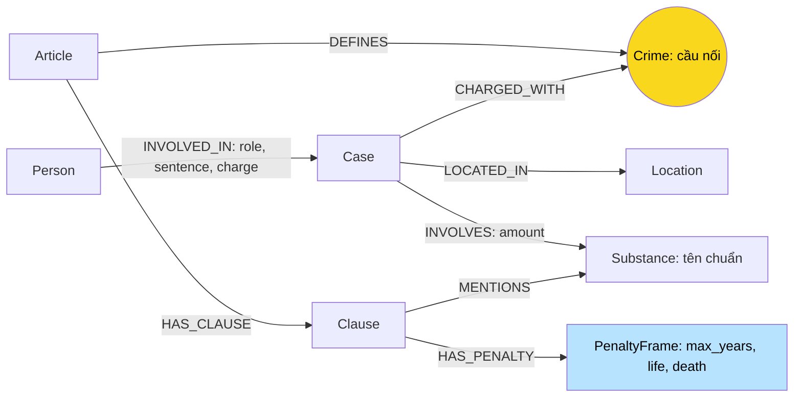

# Thiết kế Ontology — Day 19

**Họ tên:** Nguyễn Văn Huy  **MSSV:** 2A202602428

- [ ] Dùng ontology gợi ý
- [x] Tự thiết kế trên nền ontology gợi ý (xét bonus +15)

Thiết kế mới giải quyết hai vấn đề đã quan sát ở baseline: chất trùng vì chữ hoa/thường và Q4 thiếu khung phạt cao nhất. Giữ `Crime` làm cầu nối, thêm `PenaltyFrame` với thuộc tính có thể xếp hạng, đồng thời chuẩn hóa định danh chất trước khi ghi. Bằng chứng trước–sau, benchmark và giới hạn ở REPORT_KG.md; baseline nguyên trạng ở `ket_qua_benchmark_kg.hint.txt`, code baseline tại commit `3c2c12c`.

## 1. Sơ đồ

## 2. Entity types (node labels)

| Label | Ý nghĩa | Khóa MERGE | Properties | KB | Trích xuất |
| --- | --- | --- | --- | --- | --- |
| Article | Một Điều, phân biệt văn bản luật | id | id, title, law, doc_id | Luật | Metadata + regex |
| Clause | Khoản, giữ nguyên điều kiện và điểm | id | id, number, penalty, text, doc_id | Luật | Regex |
| PenaltyFrame | Khung tù của khoản, không phải mức án cá nhân | id = Clause.id + “ hình phạt” | id, text, max_years, life, death, doc_id | Luật | Hàm penalty_frame từ penalty đã trích |
| Crime | Tội danh chuẩn | name | name | Cả hai | Tiêu đề luật; LLM + link_entity phía tin |
| Case | Vụ việc được bài báo nêu | name | name, summary, date, doc_id, source_title | Tin | LLM JSON |
| Person | Người tham gia/liên quan | name | name, aliases | Tin | LLM |
| Substance | Loại chất, tên chuẩn phân biệt với tên chung | name đã canonical hóa | name | Cả hai | Luật dùng SUBSTANCES; tin dùng canonical_substance sau LLM |
| Location | Địa điểm vụ | name | name | Tin | LLM |

Constraints unique cho khóa của cả 8 label. Article, Clause, PenaltyFrame, Case có doc_id=Document.id. Crime/Substance/Person/Location dùng chung, truy nguồn qua đường tới Case/Article. Baseline chưa lưu đa nguồn cho Case: SET doc_id có thể ghi đè khi tên vụ bị gộp; chưa giải quyết giới hạn này.

PenaltyFrame.max_years chỉ biểu diễn số năm tù hữu hạn cao nhất xuất hiện trong câu penalty; có thể không tồn tại nếu chỉ có chung thân. life/death là boolean riêng. Không biến chung thân thành số năm, không dùng số từ Clause.text (tuổi, khối lượng, tiền). Không tạo frame cho khoản chỉ có hình phạt bổ sung, tiền hoặc cấm hành nghề. Phạm vi parser là cấu trúc corpus hiện tại; chưa bao phủ mọi văn bản luật.

## 3. Relationships

| Type | Từ → Đến | Properties | Ý nghĩa |
| --- | --- | --- | --- |
| DEFINES | Article → Crime | Không | Điều định nghĩa tội; Điều PCMT không tạo tội danh |
| HAS_CLAUSE | Article → Clause | Không | Khoản thuộc Điều |
| HAS_PENALTY | Clause → PenaltyFrame | Không | Khung tù của khoản, không khẳng định áp dụng cho vụ |
| MENTIONS | Clause → Substance | Không | Nhắc chất, chỉ giúp tìm khoản ứng viên |
| CHARGED_WITH | Case → Crime | Không | Tội danh trong bài; chưa phân biệt bắt/truy tố/kết án |
| INVOLVES | Case → Substance | amount (chuỗi) | Loại chất và lượng trong vụ |
| LOCATED_IN | Case → Location | Không | Địa điểm |
| INVOLVED_IN | Person → Case | role, sentence, charge (chuỗi) | Vai trò, án và tội riêng của người trong vụ |

Mức án lưu trên quan hệ người–vụ vì các bị cáo có thể nhận án khác nhau. Charge rỗng không đồng nghĩa vô tội, sentence rỗng không đồng nghĩa 0 năm. Khung cao nhất của tội không phải mức án sẽ tuyên cho một người.

## 4. Node cầu nối giữa 2 KB

- **Node:** Crime, theo Case → Crime ← Article. Substance dùng chung nhưng một chất có thể liên quan nhiều tội nên không dùng riêng chất để chọn Điều.
- **Chuẩn hóa:** lấy tên tội từ luật, đưa vào prompt, rồi link_entity chuẩn hóa hai phía, khớp chính xác trước và fuzzy cutoff=0.8; trả cách viết gốc trong danh sách hoặc None.
- **Khi gãy:** thiếu tội trong corpus, LLM trích sai/thiếu hoặc biến thể vượt ngưỡng. Không ép gán; đối chiếu doc_id và nguồn. Fuzzy match giống chuỗi không chứng minh cùng ý nghĩa.
- **Chất:** canonical_substance trim, gộp khoảng trắng, casefold và ánh xạ chính xác về danh sách SUBSTANCES. Chất chưa có danh sách giữ tên chuẩn hóa riêng; không fuzzy tên hóa chất, không đoán “ma túy” thành MDMA, chưa ánh xạ tên lóng.

## 5. Competency questions

| Câu | Đường đi / dữ kiện | Trả lời được? |
| --- | --- | --- |
| Q1 | Article {id:'Điều 2 Luật PCMT'} → Clause {number:4}; đọc text | Có dữ liệu nhưng chưa có node định nghĩa; chunks hỗ trợ retrieval. |
| Q2 | Person -[INVOLVED_IN {sentence}]-> Case; lọc đúng vụ hơn 36kg và án tử hình | Có điều kiện: LLM phải trích đủ người/án và chọn đúng vụ. |
| Q3 | Person {name:'Lê Minh Thành'} → Case → Crime ← Article → Clause {number:1} | Lấy mức án từ cạnh, đối chiếu charge riêng, lấy Điều 251 và khung cơ bản. |
| Q4 | Person theo aliases Hoàng Nato → Case → Crime ← Article → Clause → PenaltyFrame | **Cải thiện so baseline:** câu hỏi tối đa lấy mọi khoản của Điều liên quan; xếp death trước life trước max_years, lấy frame cao nhất mỗi Điều. Điều 255 khoản 4 phải được đưa vào facts. |
| Q5 | Person {name:'Cái Quang Huy'} → Case → Substance và Case → Crime ← Article → Clause → Substance; Clause → PenaltyFrame | Lấy chất, amount và khung; chưa có ngưỡng khối lượng số, nên LLM vẫn đọc Clause.text để chọn khoản 4. |
| Q6 | Case → Substance {name:'MDMA'}, thêm Person → Case nếu cần | Chuẩn hóa giảm chia cắt chất nhưng chưa gộp vụ cùng thực thể; limits/retrieval vẫn có thể thiếu vụ. |

Điểm khác cho competency question Q4 là graph mới có dữ kiện xếp hạng khung phạt có cấu trúc, được KG-3 sử dụng. Không hardcode tên người, số Điều, số khoản hoặc đáp án Q4; nhận diện loại câu hỏi bằng “tối đa/cao nhất/nặng nhất”.

## 6. Quyết định thiết kế và đánh đổi

1. **Thêm PenaltyFrame thay vì chỉ giữ chuỗi penalty.** Có thể chỉ lấy toàn văn khoản rồi để LLM tìm tối đa; chọn cấu trúc để xếp hạng death/life/years bằng Cypher và đưa fact cao nhất lên đầu. Tăng node/cạnh và parsing, chưa mô hình hóa mọi loại hình phạt.
2. **Chuẩn hóa chất chính xác, không fuzzy.** Phương án fuzzy/alias tăng độ bao phủ nhưng dễ nối sai chất gần tên. Hiện gộp khác casing đã quan sát mà không suy danh tính từ tên chung.
3. **Giữ Crime làm cầu nối.** Nối theo chất hoặc LLM đoán Điều dễ sai ý nghĩa; đổi lại vẫn phụ thuộc linking tội danh.
4. **Regex luật, LLM tin.** Regex tái lập và không gọi API; LLM hiểu văn xuôi nhưng biến động. Giữ cùng prompt/provider khi so baseline và bonus để hạn chế yếu tố nhiễu.
5. **Khung tối đa không thay lọc khoản mọi câu.** Chỉ mở rộng khi hỏi tối đa; câu khung cơ bản vẫn dùng khoản 1 và chất. Đánh đổi là prompt câu tối đa dài hơn; 60 facts không phải giới hạn token.
6. **Giữ khóa tên của Case/Person và lượng dạng chuỗi.** ID theo nguồn hoặc entity resolver sẽ tốt hơn nhưng ngoài hai cải tiến đang đo; tiếp tục ghi giới hạn trùng vụ, người trùng tên, lượng từng bị cáo và đa nguồn.

## 7. So với ontology gợi ý (bonus)

| Điểm khác | Gợi ý | Thiết kế mới | Vấn đề giải quyết | Bằng chứng |
| --- | --- | --- | --- | --- |
| Khung phạt có cấu trúc | Clause.penalty là chuỗi; lọc khoản 1/nhắc chất | PenaltyFrame + HAS_PENALTY; max_years/life/death; Cypher xếp khung cao nhất | Q4 thiếu khoản cao nhất dù luật có dữ liệu | Q4 trước/sau trong hai file benchmark; Cypher và kết quả ở REPORT_KG.md |
| Định danh chất nhất quán | MERGE name LLM viết, khác chữ hoa tạo node riêng | Chuẩn hóa tên chất trước khi ghi; không đổi tên label | Ketamine/ketamine và Methamphetamine/methamphetamine bị tách | Truy vấn nhóm toLower trước/sau trong bonus_before.json và bonus_after.json |

Baseline tại commit 3c2c12c, file ket_qua_benchmark_kg.hint.txt là bản nguyên trạng của lần chạy trước thay đổi. Benchmark mới giữ cùng chat/embedding, top-k, chunk size và dữ liệu. LLM trích tin có biến động nên không quy mọi chênh lệch node/token/quality cho ontology; kiểm tra Cypher trực tiếp giúp chứng minh hai cơ chế cụ thể.

## 8. Hạn chế và tự phản biện

- Frame cho biết khung tối đa của tội theo corpus, không suy khoản áp dụng nếu thiếu điều kiện vụ; không phải tư vấn luật hiện hành.
- Ranking không xử lý hình phạt tù có điều kiện, lựa chọn phạt tiền, cải tạo hoặc tương tác nhiều tội. Parser chỉ tạo frame khi penalty có “phạt tù”; bỏ sót cấu trúc khác cần audit riêng.
- Không hardcode đáp án gold; tests chỉ kiểm tra hợp đồng/domain parsing và các lỗi cần tránh, không sửa tests gốc hoặc benchmark.
- Chưa có alias ngữ nghĩa cho chất, chưa gộp vụ/người đa nguồn, chưa giữ lịch sử tố tụng. Không tuyên bố Q6 đã giải quyết chỉ vì giảm trùng Substance.
- Đã thay ba ảnh bằng ảnh graph bonus: count có 246 node/44 PenaltyFrame; ảnh vụ riêng có Clause → HAS_PENALTY → PenaltyFrame. Giới hạn hiển thị truy vấn ảnh vụ riêng và trạng thái nộp link ghi trong REPORT_KG.md.
