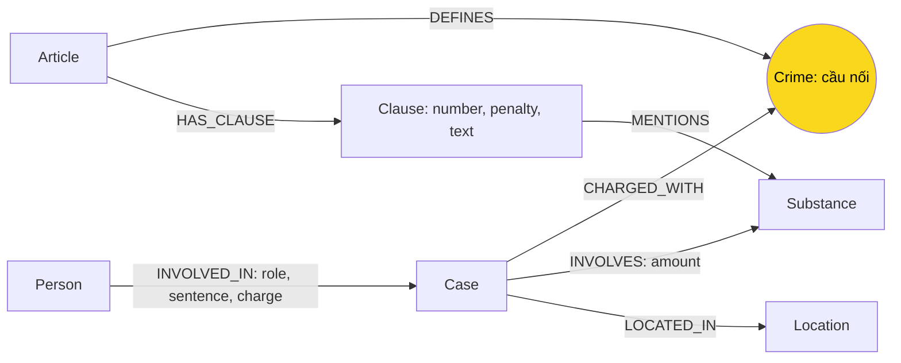

# Thiết kế Ontology — Day 19

**Họ tên:** Nguyễn Văn Huy  **MSSV:** 2A202602428

> Trạng thái nộp bài (2026-10-05): KG-1–KG-4 đã triển khai; 48 test pass, `--check` đủ 7 OK và benchmark toàn corpus đã chạy. Kết quả cuối, kiểm chứng schema và lỗi thực nghiệm ở [REPORT_KG.md](REPORT_KG.md). Ba ảnh đã có trong `report/img/`; giới hạn quy cách ảnh và trạng thái nộp link được ghi trong báo cáo.

**Lựa chọn** (đánh dấu một):
- [x] Dùng ontology gợi ý (có thể chỉnh nhỏ)
- [ ] Tự thiết kế (xét bonus +15, xem `SUBMISSION.md`)

> Thiết kế được lập trước khi code, dùng các hàm HINT của `src/graph.py`, sau đó đã dựng và đối chiếu label/relationship trên Neo4j. Không xét bonus tự thiết kế; không cần file benchmark hint riêng vì đây chính là ontology gợi ý.

## 1. Sơ đồ

Hai KB nối qua `Crime`; `Substance` cũng dùng chung nhưng chỉ cùng loại chất không đủ để xác định tội danh.

## 2. Entity types (node labels)

| Label | Ý nghĩa | Khóa định danh (`MERGE` theo) | Properties | Lấy từ KB nào | Trích bằng (regex / LLM / khác) |
| --- | --- | --- | --- | --- | --- |
| `Article` | Một Điều, phân biệt BLHS và Luật PCMT | `id`, ví dụ `Điều 251 BLHS` | `id`, `title`, `law`, `doc_id` | Luật | Metadata + `parse_law_article` |
| `Clause` | Một khoản, giữ văn bản để LLM đọc điều kiện | `id`, ví dụ `Điều 251 BLHS khoản 1` | `id`, `number` (số nguyên), `penalty`, `text`, `doc_id` | Luật | Regex tách khoản, khung phạt và `find_substances` |
| `Crime` | Tội danh chuẩn, dùng chung giữa các vụ và luật | `name` đã chuẩn hóa | `name` | Tiêu đề luật; tin liên kết về danh sách luật | `normalize_crime`; LLM + `link_entity` ở phía tin |
| `Case` | Vụ việc cụ thể trong bài báo | `name` | `name`, `summary`, `date`, `doc_id`, `source_title` | Tin | `extract_news_cases` dùng LLM trả JSON |
| `Person` | Người tham gia hoặc liên quan vụ việc | `name` | `name`, `aliases` (danh sách) | Tin | LLM; vai trò không nằm trên node |
| `Substance` | Loại chất được nhắc đến | `name` | `name` | Cả hai | Luật: danh sách `SUBSTANCES` + tìm chuỗi; tin: LLM với tên chuẩn trong prompt |
| `Location` | Địa điểm của vụ việc | `name` | `name` | Tin | LLM |

`suggested_constraints()` tạo uniqueness constraint cho từng khóa trên. `MERGE` chỉ gộp khi khóa khớp; constraint không nhận ra hai tên khác nhau cùng chỉ một thực thể.

**Nguồn gốc dữ liệu:** theo helper, `Article`, `Clause`, `Case` có `doc_id = Document.id`, nối với metadata của chunk vector. `Crime`, `Substance`, `Person`, `Location` là node có thể dùng chung nên helper không gán một `doc_id` đơn lẻ. Truy nguồn chúng qua node tài liệu kề hoặc đường đi tới `Case`/`Article`. `Case.doc_id` chỉ giữ một nguồn và có thể bị ghi đè khi hai bài tạo cùng tên vụ; đây là hạn chế chấp nhận ở baseline, không phải cơ chế lưu đầy đủ nhiều nguồn.

## 3. Relationships

| Type | Từ → Đến | Properties trên cạnh | Ý nghĩa |
| --- | --- | --- | --- |
| `DEFINES` | `Article` → `Crime` | Không | Điều luật định nghĩa tội danh; Điều PCMT không có tiêu đề `Tội ...` không tạo cạnh này |
| `HAS_CLAUSE` | `Article` → `Clause` | Không | Khoản thuộc Điều luật |
| `MENTIONS` | `Clause` → `Substance` | Không | Khoản nhắc tên chất; không có nghĩa vụ án chắc chắn thuộc khoản đó |
| `CHARGED_WITH` | `Case` → `Crime` | Không | Tội danh được bài báo nêu cho vụ; chưa phân biệt bắt, truy tố và kết án |
| `INVOLVES` | `Case` → `Substance` | `amount` (chuỗi) | Chất và lượng được nêu trong vụ; chưa biểu diễn lượng từng người phải chịu trách nhiệm |
| `LOCATED_IN` | `Case` → `Location` | Không | Địa điểm của vụ |
| `INVOLVED_IN` | `Person` → `Case` | `role`, `sentence`, `charge` (chuỗi) | Vai trò, mức án và tội danh riêng của người trong vụ |

Chuỗi rỗng nghĩa là không trích được hoặc nguồn không nêu, không phải mức án bằng 0. Đặc biệt `INVOLVED_IN.charge` cần dùng để phân biệt các bị cáo có tội khác nhau trong cùng vụ.

## 4. Node cầu nối giữa 2 KB

- **Node nào:** `Crime`, theo đường `Case -[:CHARGED_WITH]-> Crime <-[:DEFINES]- Article`.
- **Vì sao chọn node này:** báo nêu tội danh của vụ; tiêu đề Điều BLHS nêu cùng tội danh. Chất như MDMA có thể liên quan nhiều tội nên không dùng riêng chất để chọn Điều luật.
- **Cách đảm bảo hai phía khớp tên:** lấy tên chuẩn từ luật; đưa danh sách vào prompt trích tin. KG-1 sẽ chuẩn hóa cả đầu vào lẫn danh sách, khớp chính xác trước rồi dùng `difflib.get_close_matches` với `cutoff=0.8`, trả cách viết gốc trong danh sách hoặc `None`. `normalize_crime` hiện có xử lý chữ thường, khoảng trắng, dấu nháy và tiền tố `tội`; chưa tự đổi `tuý` thành `túy`, nên khác biệt này cần kiểm tra ở bước linking.
- **Khi nào cầu gãy:** tin chỉ nêu hành vi, tên tội không có trong corpus, LLM trích thiếu/sai hoặc khác cách viết quá nhiều. Không ép nối khi thiếu căn cứ; giữ phần tin và đối chiếu nguồn qua `doc_id`, kiểm tra vụ không có `CHARGED_WITH`. Nếu sửa chuẩn hóa hoặc prompt sau này, chạy lại test và kiểm tra đường nối. Fuzzy match cũng có thể nối sai giữa các tội gần tên; ngưỡng giống chuỗi không chứng minh tương đương ý nghĩa.

## 5. Competency questions

Với mỗi câu trong `data/benchmark_kg.json`, ghi đường đi trên graph dùng để trả lời. Câu nào không trả lời được thì ghi rõ lý do.

| Câu | Đường đi (Cypher pattern) | Trả lời được? |
| --- | --- | --- |
| Q1 | `(a:Article {id:'Điều 2 Luật PCMT'})-[:HAS_CLAUSE]->(cl:Clause {number:4})`; đọc `cl.text` | Có dữ liệu trong graph, nhưng không có node khái niệm `Tiền chất`. Cần chunk vector hoặc truy vấn tới đúng khoản; seed 1-hop chỉ nêu cạnh không bảo đảm đưa `text` vào prompt. |
| Q2 | `(p:Person)-[r:INVOLVED_IN]->(k:Case)`; lọc đúng vụ hơn 36kg tại TP.HCM và `r.sentence` là tử hình | Có điều kiện: LLM phải trích đủ người/mức án, truy vấn phải xác định đúng vụ bằng nguồn và nội dung, không lấy mọi vụ cùng địa điểm. |
| Q3 | `(p:Person {name:'Lê Minh Thành'})-[r:INVOLVED_IN]->(k:Case)-[:CHARGED_WITH]->(c:Crime)<-[:DEFINES]-(a:Article)-[:HAS_CLAUSE]->(cl:Clause {number:1})` | Có điều kiện: đối chiếu `r.charge` với `c.name`, đọc `r.sentence` và `cl.text`; kỳ vọng theo corpus: 36 tháng, Điều 251, 02–07 năm. |
| Q4 | `(p:Person)-[r:INVOLVED_IN]->(:Case)-[:CHARGED_WITH]->(c:Crime)<-[:DEFINES]-(a:Article)-[:HAS_CLAUSE]->(cl:Clause)`; tìm `Hoàng Nato` trong `p.aliases`, đối chiếu `r.charge` | Có dữ liệu nếu trích đúng alias/tội danh và lấy các khoản có hình phạt, đặc biệt khoản 4 Điều 255. Quy tắc HINT chỉ khoản 1 + khoản nhắc chất có thể bỏ sót khung cao nhất. Khung tối đa trong corpus không phải mức án đã tuyên cho người này. |
| Q5 | `(p:Person {name:'Cái Quang Huy'})-[r:INVOLVED_IN]->(k:Case)-[:INVOLVES]->(s:Substance)` và `(k)-[:CHARGED_WITH]->(:Crime)<-[:DEFINES]-(a:Article)-[:HAS_CLAUSE]->(cl:Clause)-[:MENTIONS]->(s)` | Một phần: graph lấy được chất, chuỗi `amount` và văn bản khoản. LLM phải đối chiếu hơn 9,6kg MDMA với ngưỡng 100g tại khoản 4 Điều 250; schema không có phép so sánh ngưỡng số hay bộ suy luận chọn khoản tự động. |
| Q6 | `(k:Case)-[:INVOLVES]->(:Substance {name:'MDMA'})`; trả vụ khác nhau, mở rộng `(p:Person)-[:INVOLVED_IN]->(k)` nếu cần tên người | Có điều kiện: quét toàn graph và đủ dữ liệu trích xuất. Top-k chunk, giới hạn facts hoặc các tên chất không thống nhất có thể bỏ sót vụ; `DISTINCT` không gộp hai tên khác nhau của cùng vụ. |

Các pattern trên mô tả cách tìm dữ liệu cần thiết, không bảo đảm KG-3 hiện tại trả đủ facts cho mọi câu. Đã kiểm tra đường Person → Case → Crime ← Article và chạy Q1–Q6 qua benchmark. Khả năng biểu diễn của schema và khả năng truy xuất là hai việc khác nhau; hạn chế Q4/Q6 được ghi bằng kết quả thực tế trong báo cáo.

### Đối chiếu dữ liệu đã đọc

- `data/drug_law/blhs-dieu-251.md`: cấu trúc Điều → khoản → điểm; khoản 1 là khung cơ bản, khoản 4 nhắc MDMA và ngưỡng khối lượng. Chọn lưu đầy đủ `Clause.text` để giữ các điều kiện.
- `data/drug_news/news-100260918080821054.md`: Lê Minh Thành 36 tháng tù, ba đồng phạm 24 tháng; MDMA và ketamine; phúc thẩm bị hoãn. Vì mức án khác nhau, lưu `sentence` trên quan hệ người–vụ.
- `data/drug_news/news-100260928173914514.md`: Trần Thanh Tuấn và Trần Minh Tâm bị tuyên tử hình về mua bán; Đinh Đức Tuấn và Trần Ngọc Thảo có tội tổ chức sử dụng. Một vụ nhiều tội nên không gán mọi tội của vụ cho mọi người.
- `data/drug_news/news-100260917203001265.md`: Cái Quang Huy liên quan hơn 9,6kg MDMA và khoảng 406g Ketamine; Nguyễn Tiến Đạt có lượng trách nhiệm khác; Nguyễn Hữu Đức bị hủy quyết định khởi tố. Chỉ xuất hiện tên không đủ để gán tội.
- `data/drug_news/news-100260925144412498.md`: Dương Minh Tuấn có alias Hoàng Nato; bài nhắc etomidate và nhiều đường dây. Etomidate chưa có trong `SUBSTANCES`; cần tránh gộp mọi hành vi trong bài thành tội riêng của người này.
- Đọc bổ sung `pcmt-dieu-2.md`, `blhs-dieu-250.md`, `blhs-dieu-255.md` để đối chiếu Q1, Q4, Q5. Những mô tả trên chỉ nói về corpus được cung cấp, không xác nhận luật đang có hiệu lực hiện tại.

**Thực thể có ở cả hai KB:** tội danh và loại chất. Người, vụ và địa điểm chủ yếu từ tin; Điều và khoản từ luật. Khối lượng, mức án là dữ kiện được mô hình hóa bằng property hoặc văn bản, không phải node riêng trong lựa chọn này.

## 6. Quyết định thiết kế và đánh đổi

Ít nhất 3 quyết định. Mỗi quyết định ghi: đã chọn gì, phương án khác là gì, vì sao chọn.

1. **Dùng `Crime` làm cầu nối.** Phương án khác: nối trực tiếp vụ vào số Điều do LLM đoán hoặc chỉ nối qua chất. Chọn tên tội chuẩn từ luật để dễ kiểm tra và tránh suy Điều từ chất; đánh đổi là phụ thuộc chất lượng linking.
2. **Regex cho luật, LLM cho tin.** Phương án khác: dùng LLM cho cả hai. Luật có cấu trúc đều nên regex dễ tái lập và không tốn token; đổi lại có thể không trích được khung phạt khi bố cục khác. Tin cần hiểu ngữ cảnh nên dùng LLM, chấp nhận chi phí và biến động.
3. **Tách tới khoản, giữ điểm trong `Clause.text`.** Phương án khác: node riêng cho từng điểm và ngưỡng. Baseline ít loại node, giữ đủ văn bản cho LLM đọc; đánh đổi là Q5 chưa được giải bằng so sánh số có cấu trúc. `MENTIONS` chỉ hỗ trợ tìm khoản ứng viên.
4. **Mức án và vai trò đặt trên `INVOLVED_IN`.** Phương án khác: property trên `Person` hoặc node bản án riêng. Một người có thể liên quan nhiều vụ nên property trên cạnh giữ đúng phạm vi vụ; vẫn chưa giữ được lịch sử sơ thẩm/phúc thẩm trong cùng vụ.
5. **Giữ khóa HINT: `id` cho Điều/khoản, `name` cho các loại còn lại.** Phương án khác: ID ổn định theo nguồn và cơ chế phân giải thực thể. Chọn tương thích helper và dễ triển khai baseline; chấp nhận tên vụ do LLM đặt thiếu ổn định, người trùng tên bị gộp và cùng người khác tên bị tách. Constraint chỉ bảo vệ sự duy nhất của chuỗi khóa.
6. **Giữ chuỗi khối lượng và khung phạt nguyên văn.** Phương án khác: chuyển sang gam, số năm, cờ chung thân/tử hình và khoảng ngưỡng. Baseline tránh mất dấu “hơn”, “gần” và nhiều đơn vị; đánh đổi là chưa thể tính toán, chọn khung tối đa hoặc khoản bằng Cypher số học một cách đáng tin cậy.

## 7. So với ontology gợi ý (bắt buộc nếu xét bonus)

| Điểm khác | Gợi ý làm gì | Bạn làm gì | Vấn đề nó giải quyết | Bằng chứng (Cypher, hoặc số liệu benchmark) |
| --- | --- | --- | --- | --- |
| Không thay schema HINT | 7 label, 7 relationship; khóa và properties theo helper | Giữ nguyên schema; bổ sung kế hoạch truy vấn và giới hạn trong tài liệu | Tạo baseline dễ kiểm tra trước khi cải tiến | Đã đối chiếu tĩnh `suggested_constraints`, `add_law_article`, `add_news_case`; chưa có graph/benchmark trước–sau, không yêu cầu bonus |

## 8. Hạn chế còn lại

- Đã triển khai và chạy benchmark, nhưng mới đo sáu câu hỏi với một provider; chưa có bằng chứng cải thiện trước–sau để xét bonus. Schema vẫn giữ các hạn chế của baseline.
- Q1 phụ thuộc lấy văn bản khoản hoặc chunk, vì schema không có node định nghĩa. Q4 cần chủ động lấy khung cao nhất thay vì chỉ khoản 1. Q5 phụ thuộc suy luận văn bản; Q6 cần truy vấn tổng hợp toàn graph.
- Chuẩn hóa chất mới dựa vào danh sách trong prompt và tìm chuỗi phía luật. Helper không gọi `link_entity` cho chất trong tin, không tự gộp `MDMA`/`mdma`, tên lóng hoặc tên đồng nghĩa.
- Khóa tên và cập nhật bằng `SET` có thể làm mất nguồn, alias hoặc ghi đè mức án khi gộp dữ liệu. Không lưu lịch sử thay đổi hay độ tin cậy trích xuất.
- `Case` có nhiều tội nhưng `Person` không nối trực tiếp với `Crime`; khi trả lời về người phải kiểm tra `INVOLVED_IN.charge`. Người liên quan, bị bắt, bị truy tố và bị kết án không được coi là cùng trạng thái.
- Một số file báo có đoạn giới thiệu bài liên quan ở cuối: file về Lê Minh Thành có đoạn Cái Quang Huy, file về kiện hàng Berlin có đoạn chủ quán bar F1. LLM có thể tạo thêm vụ từ phần này; cần đối chiếu tiêu đề, nội dung chính và nguồn trước khi coi đó là dữ kiện đầy đủ.

### Tự review và phản biện thiết kế

| Câu hỏi phản biện | Kết luận và việc kiểm chứng tiếp theo |
| --- | --- |
| Có khớp code HINT không? | Đã so 7 label, 7 cạnh, khóa và properties với helper; lưu ý `Clause.doc_id` và `Case.source_title` thực sự được ghi dù sơ đồ đầu file không liệt kê hết. Snapshot Neo4j có đủ 7 label và 7 type, khớp sơ đồ và bảng. |
| Có hứa trả lời mọi câu chỉ nhờ graph không? | Không. Q1 cần nội dung định nghĩa; Q5 chưa có ngưỡng cấu trúc; Q4/Q6 cần chiến lược truy vấn phù hợp. Phải đọc câu trả lời thực tế, không chỉ dựa vào `--check`. |
| Vì sao không tự thiết kế để lấy bonus ngay? | Cần baseline và bằng chứng trước–sau để chứng minh cải thiện. Đổi tên label hoặc tuyên bố giảm trùng mà chưa đo không đủ điều kiện bonus. |
| Có lỗi nào đã chứng minh trên graph chưa? | Có. Báo cáo ghi E2 bỏ sót khoản luật và E3 trùng tên chất, có câu trả lời/Cypher và kết quả để đối chiếu. |
| Thiết kế và code xong có nghĩa bài lab xong không? | Không. Checklist code và benchmark đã đạt, ba ảnh đã có nhưng cần kiểm tra quy cách; thao tác nộp link trên vlearn chưa được xác nhận. |
